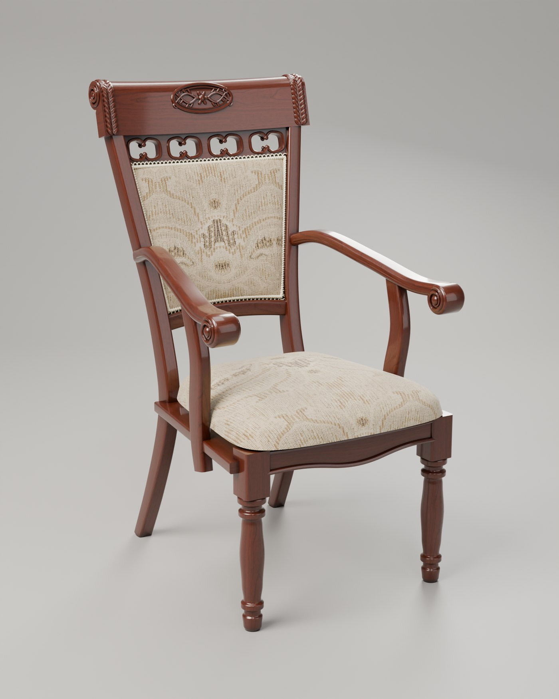
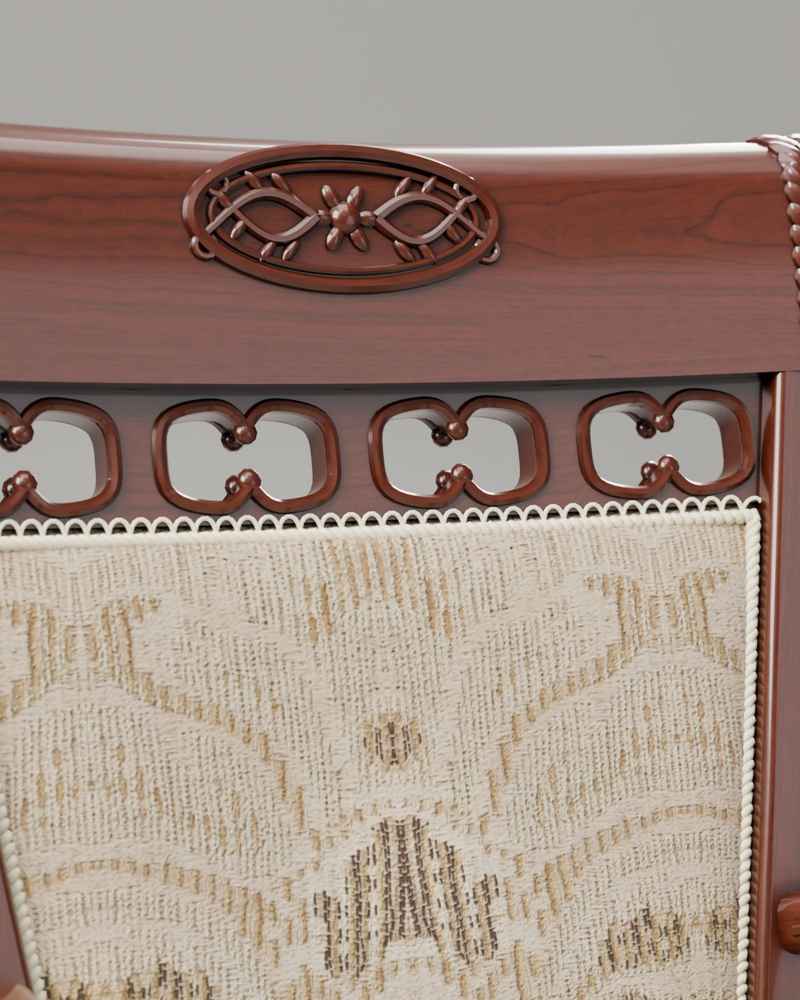
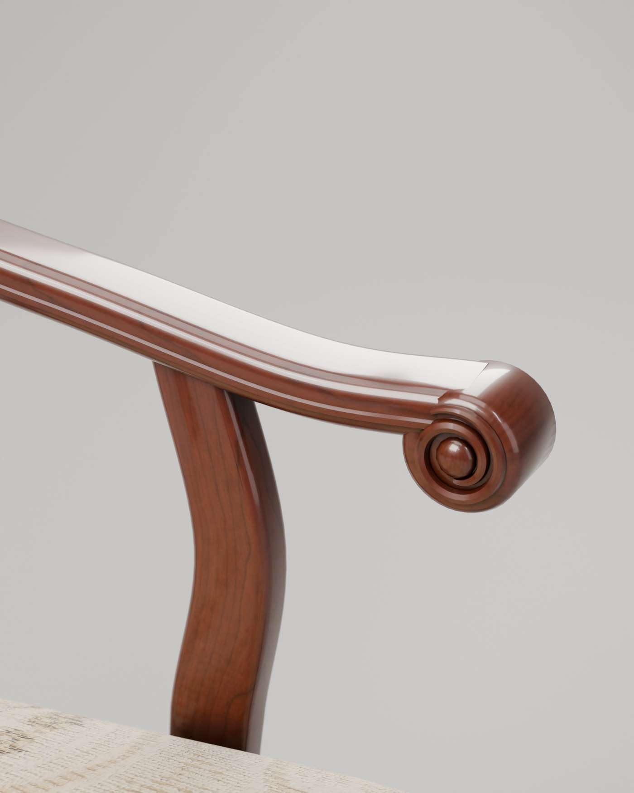

# Heritage Armchair — a phone-photos-to-3D test

**Live demo: https://heritage-armchair-3d.vercel.app**



## What this is

A personal test. This is **my own chair** — an old carved armchair sitting at home. I took a handful of **ordinary phone pictures** of it (no scanner, no photogrammetry rig, no studio, no measurements) and wanted to find out one thing:

> Can a normal set of phone photos be turned into a clean, realistic, web-ready 3D model?

This repo is the answer: the full pipeline from photos to a Blender model, path-traced studio renders, and an interactive 3D page that runs on a phone.

It is an experiment, not a product. The proportions are read off photos by eye, and the carving is a faithful interpretation rather than a millimetre-exact copy.

## How it works

Eleven photos were not enough for photogrammetry (different rooms, different light, too few angles), so the chair is **modelled procedurally in Blender's Python API** — built the way the real thing is built:

| Part | How it's made |
|---|---|
| Turned front legs | A lathe profile revolved around an axis |
| Sabre back legs + back posts | A rounded section swept along a spline |
| Scroll-back top rail | A rolled profile extruded along a curved, raked back plane |
| Carved medallion, leaf bands, volutes | Real geometry — tubes, spirals and leaf shapes laid on the surface |
| Pierced fretwork band | Four cells, each a ring between a rectangle and a shaped opening |
| Upholstered back + seat | Domed cushion solids with real-world-scale UVs |
| Gimp braid trim | A twisted two-ply cord plus ~300 scalloped loops, front and back |

**The fabric is the real fabric.** `scripts/make_fabric.py` takes one phone close-up of the actual damask, removes the lighting gradient, cleans it, and mirrors it into a seamless tile — then derives a normal map and a roughness map from the same photo.

**The wood** is a CC0 cherry veneer, stained offline to the chair's dark red-brown lacquer tone, with a clearcoat layer on top.

## Results

| | |
|---|---|
| Model | ~158k triangles, three materials |
| Web file | `web/chair.glb` — about 2 MB (Draco geometry + WebP textures) |
| Stills | 1600×2000, Cycles, CPU-only, ~9 minutes each on a 4-core laptop |
| Viewer | [`<model-viewer>`](https://modelviewer.dev), view presets, works on mobile |

<p>


</p>

## Run it yourself

Requires Blender 5.x (bundles numpy) and Python with Pillow + numpy for the two texture scripts.

```bash
python scripts/make_wood.py                                  # stain the wood texture
python scripts/make_fabric.py                                # needs your own fabric photo in refs/
blender -b -P scripts/build_chair.py                         # build out/chair.blend
blender -b out/chair.blend -P scripts/export_glb.py          # write web/chair.glb
bash scripts/render_all.sh                                   # all studio stills, one at a time
```

Single still: `blender -b out/chair.blend -P scripts/render_chair.py -- <view> <abs/path/out.png> 1600 110`
Views: `hero, front, side, back, high, detail_back, detail_arm, detail_seat`.

Serve `web/` with any static server (`python -m http.server`) to try the viewer locally.

## Repo layout

```
scripts/   build_chair.py · render_chair.py · export_glb.py · make_fabric.py · make_wood.py · render_all.sh
tex/       wood, fabric and studio-lighting textures
web/       index.html · chair.glb · img/   (this folder is what's deployed)
out/final/ full-resolution studio renders
```

The original reference photos are **not** in the repo — they were taken inside my home. The generated fabric texture in `tex/fabric/` is included, so everything except `make_fabric.py` runs without them.

## Honest limits

- Dimensions are estimates (~65 × 76 × 112 cm). Three tape-measure numbers would make it exact; they live at the top of `build_chair.py`.
- Carving detail is simplified — right layout and feel, not every chisel stroke.
- A real-time web viewer will never match the path-traced stills. Stills are for looking; the viewer is for turning.
- AR button is included but untested on a physical device.

## Credits

- Wood, weave-normal and studio HDRI textures: [Poly Haven](https://polyhaven.com) (Cherry Veneer, Rough Linen, Photo Studio 01, Studio Small 08) — CC0.
- Viewer: Google's `<model-viewer>`.
- Modelled, rendered and deployed with Blender, Python and [Claude Code](https://claude.com/claude-code).
